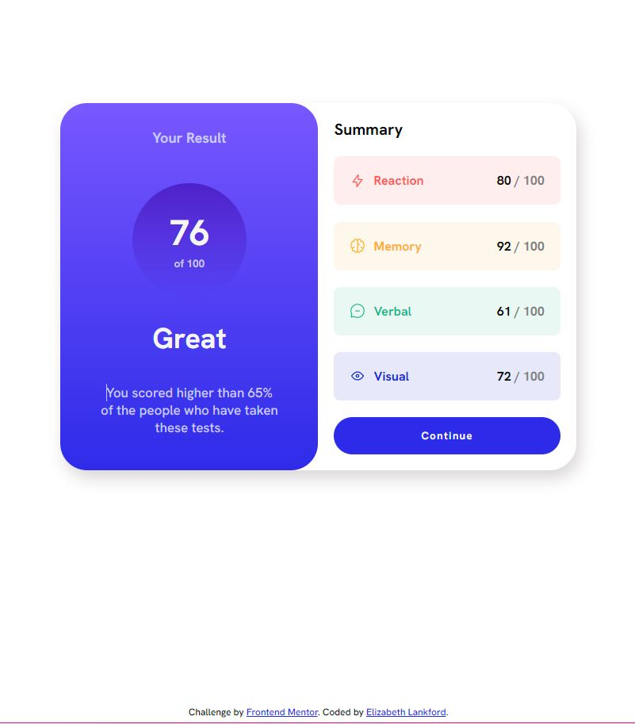
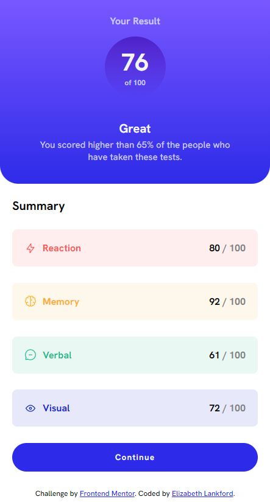

# Frontend Mentor - Results summary component solution

This is a solution to the [Results summary component challenge on Frontend Mentor](https://www.frontendmentor.io/challenges/results-summary-component-CE_K6s0maV). Frontend Mentor challenges help you improve your coding skills by building realistic projects.

## Table of contents

- [Overview](#overview)
- [The challenge](#the-challenge)
- [Screenshot](#screenshot)
- [Links](#links)
- [My process](#my-process)
- [Built with](#built-with)
- [What I learned](#what-i-learned)
- [Continued development](#continued-development)
- [Useful resources](#useful-resources)
- [Author](#author)

## Overview

Frontend Mentor Challenge to create a result summary component. I utilized HTML, CSS, and React.

### The challenge

Users should be able to:

- View the optimal layout for the interface depending on their device's screen size
- See hover and focus states for all interactive elements on the page

### Screenshot



Desktop view.



Mobile device view.

### Links

- Repository URL: [Add solution URL here](https://github.com/ElizabethLankford/Summary-React-component)
- Live Site URL: [Add live site URL here](https://your-live-site-url.com)

## My process

### Built with

- Semantic HTML5 markup
- CSS custom properties
- Flexbox
- Mobile-first workflow
- [React](https://reactjs.org/) - JS library

### What I learned

With this project, I practiced the use of props in React components. I used props to pull data from the data.json file instead of hard coding the information.

code snippet of mini sections with different information and classNames, see below:

```js
export default function MiniSection(props) {
  return (
    <div className={`mini-section ${props.category}`}>
      
      <h4>{props.category}</h4>
      <p>
        <span>{props.score}</span> / 100
      </p>
    </div>
  );
}
```

### Continued development

I do want to continue using the React framework to practice and perfect composability within my code.

### Useful resources

- [resource 1 - Markdown cheatsheet](https://www.markdownguide.org/cheat-sheet/) - This helped me create the markdown page to better explain my code to others. I do plan on putting effort towards my README.md files more since it can be beneficial to others interpriting my code.

## Author

- Website - [Elizabeth Lankford](https://elizabeth-lankford.com/)
- Frontend Mentor - [@ElizabethLankford](https://www.frontendmentor.io/profile/ElizabethLankford)
- LinkedIn - [Elizabeth Lankford](https://www.linkedin.com/in/elizabethlankford/)
